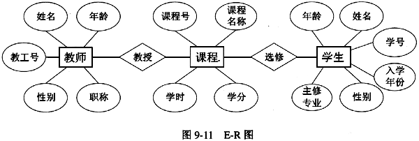
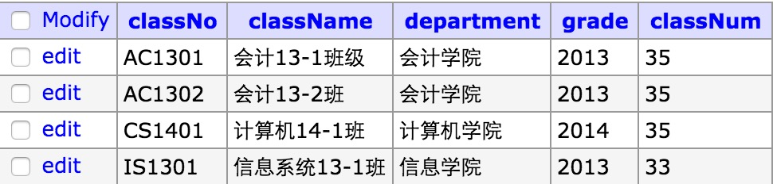

#mysql简介

##市面上的数据库
* sqlserver
* oracle
* db2
* sqllite
* access
* nosql/mongodb/redis

##E-R图
>现实世界当中两个实体集之间的关系，方框代表实体，菱形代表关系，椭圆代表属性。

* 1对1
* 1对多
* 多对多

##关系型数据库
>关系型数据库以二维表的形势组织数据。

###表
>表由表明、构成表的各个列以及若干行数据构成，每一个表都有一个唯一的表明。

###列
>列也叫字段或者属性。每个字断都有一个字段名。每个字断都有一种数据类型，每个字断都需要限定类型的长度。

###行
>表中的数据都是按照行来存储的。表中的行也称记录。

##数据库的基本操作

###创建一个数据库

	CREATE DATABASES 数据库名;
###查看所有的数据库
	SHOW DATABASES;

###删除一个数据库
	DROP DATABASES 数据库名;
###使用一个数据库
	USE 数据库名;

##表的基本操作
###创建一个表
	CREATE TABLE `表名` (
		`classNo` varchar(20) NOT NULL,
		`className` varchar(50) NOT NULL,
		`department` varchar(100) NOT NULL,
		`grade` varchar(20) DEFAULT NULL,
		`classNum` int(10) DEFAULT NULL
	) ENGINE=InnoDB DEFAULT CHARSET=utf8;
###查看所有的数据库表
	SHOW TABLES;
###删除数据库表
	DROP TBALE 表名
	
##GUI操作
* 添加数据库与字符集
* 选择数据库
* 类型验证
* 类型长度验证
* null/not null验证
* 默认值验证
* auto increment验证

##数据库的导入与导出
###导入
* source 文件名;
* 直接执行sql语句;
* 使用工具导入;

###导出
* 工具导出;
	

