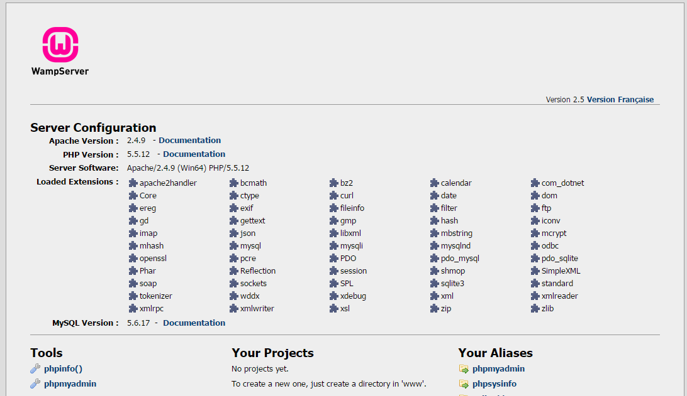

# php环境搭建（服务器套件搭建）
##软件安装
软件下载地址 `http://www.wampserver.com/en/#download-wrapper`
`尽量安装到非系统盘`
###可能遇到的错误
* msvrc110.dll丢失问题 （下载[连接](http://www.microsoft.com/zh-CN/download/details.aspx?id=30679 )）

###安装完成的标志
>在浏览器中打开http://localhost可以打开以下界面

C:\Windows\System32\drivers\etc\hosts

##什么叫服务器套件
它包含了，apache（web服务器），php，mysql（数据库），邮件服务器

###apache
它是一个web服务器，web服务器是处理http请求的一个软件，它的作用是，当客户端请求html文件的时候，就原样的返回html。如果请求图片的话，就原样输出图片，如果是js也是一样，但是当请求php文件的时候，web服务器就会把php文件，先做一次php解析，再输出成html。
###php语言
用来解析php文件的源代码的一个程序。
###mysql数据库
是一种数据库，他的作用就是存储数据。
