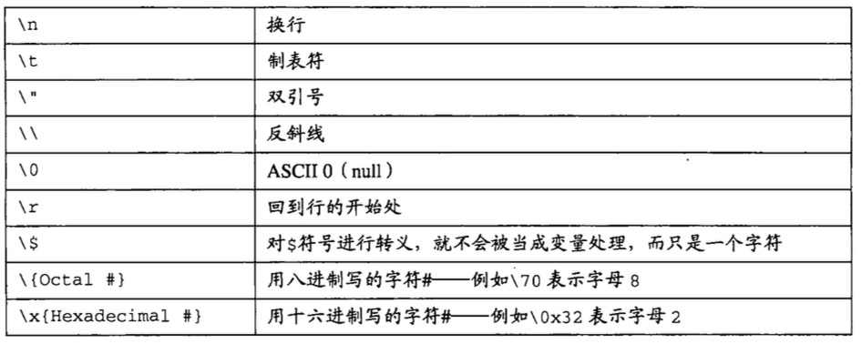
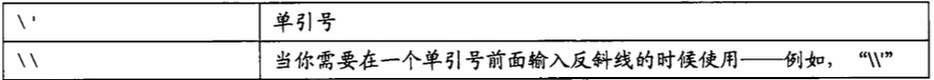

#php基础数据类型

##整型
>它是由所有的整数构成，在32位计算机中它的范围为－2147483648 到 2147483647

例如:
	
	123456
	0xCCC
	0007
	-10000
##浮点型
>可以直接理解成小数，范围是 2.2E-308 到1.8e+308

例如：
	
	3.14
	+0.9e-2
	-170000.5
	56.4e42
	
##字符类型
>用引号扩起来的内容统称为字符串，可以使用单引号可以使用双引号

	“PHP:Pre-processor”
	"123123123123"
	"3.1415926"

###转义字符
* 双引号支持的字符有：

例如："This result is good \n good is nice"
* 单引号支持的字符有：

###在字符串中使用变量

	$name = "Guido";
	echo "Hi, $name\n";
	echo 'Hi, {$name}good';

##布尔类型
>只有两个值 true 和 false

##一般布尔类型跟if语句结合
	$value = false;
	if($value){ 
		echo "good";
	}else{
		echo "是false";
	}

##还有一些值，他们作为判断语句的话，也是false
	0
	0.0
	""
	"0"
	空数组
	空对象
	NULL
##null
>一个没有值的值,
如果一个变量从来没有被赋值，或者直接被赋值为null，那么他的值就是null 
例如：

	$some;
	echo $some;
	
##数组
>数组是一个 关键字/值 的一个集合，这里的关键字可以是数组也可以是字符串，这里的值可以是任何一种类型。

⚠️使用var_dump()函数可以更清楚的看到数据类型的情况。

⚠️ 这里的关键字是可以省略的，如果省略，那么就是按照从0开始自增的方式增加。

例子:

* array(1,2,3)等于array(0=>1,1=>2,2=>3)
* array("name"=>"niap","age"=>28);
* array(1=>"ONE","TWO","THREE")等于array(1=>"ONE",2=>"TWO",3=>"THREE")

❓array("ONE",5=>"TWO","THREE")等于多少
array("ONE","good"=>"go","THREE")

##读取/修改数组的值
>可以使用$arr[key]的方式来读取数组的值

	$arr = array("name"=>"niap","age"=>28);
	echo $arr['age'];
	$arr['age'] = 55;
	echo $arr["age"];
##数组嵌套（多维数组）
	
	$arr = array(
	array('name'=>"niap1","age"=>28),
	array('name'=>"niap2","age"=>29),	array('name'=>"niap3","age"=>30),
	)
