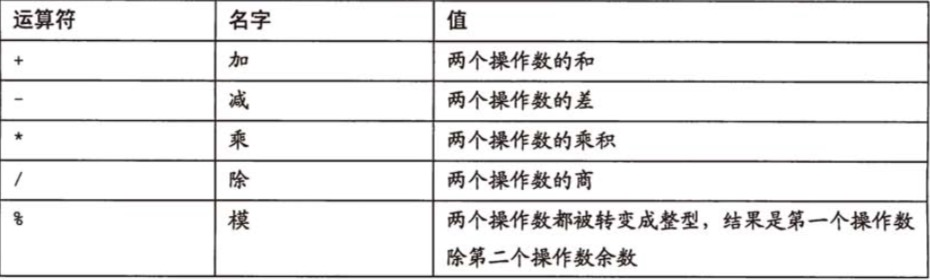
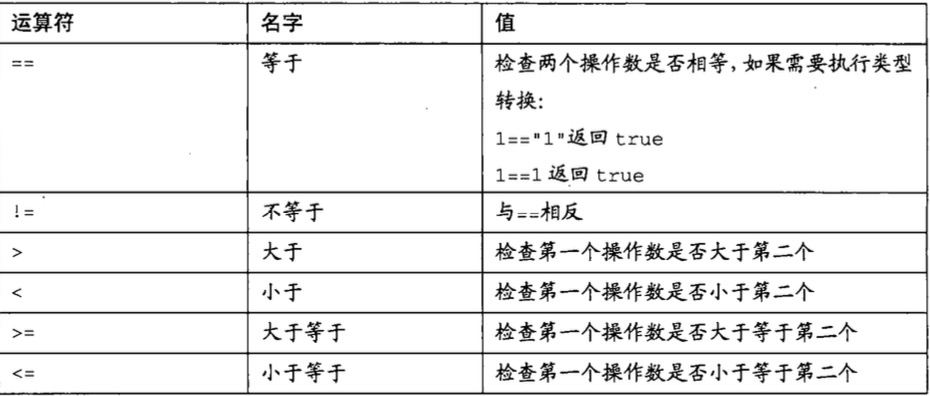
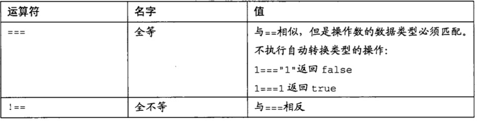
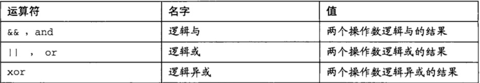

#php运算符

##表达式的概念
最小的表达式就是一个数字或者是字符串再或者是布尔值。稍微复杂的表达式可以在基础的数据上加上运算符。

##赋值运算符
>赋值运算符让你把一个值或一个表达式写入到一个变量。第一个操作必须是变量。
	
	<?php
		var_dump($num = "niap");
	?>

###数字运算符(二目运算符)

	<?php
		$num = 1;
		var_dump($num + 8);
		var_dump($num + '8');
	?>

###复合运算符
>让赋值运算符和数值运算符组合形成的运算符

	$counter += 2;
	$sum *= $counter;
	/*
	+=,-=,*=,/=
	*/
例如

	<?php
		$counter = 0;
		$counter += 2;
		$counter += 5;
		var_dump($counter);
		
	?>
	
##比较运算符
>它的返回值为布尔类型

⚠️都需要与if结合做实例
* 做主动转换的比较运算符

	<?php
		var_dump(1>2);
		var_dump(3<4);
		var_dump("3"==3);
		var_dump(3<=3);
	?>

* 不做自动转换的比较运算符

	<?php
		var_dump(1===3);
		var_dump(2===3);
		var_dump(false===0);
	?>

##逻辑运算符
>它的返回值也必然是布尔类型

	<?php
		var_dump(true && false);
		var_dump(1>2 && 3<4);
		
		$num = 3;
		1>2 && $num=5;
		echo $num;
	?>

##自增／自减运算符
	$var++; //自增 相当于 $var = $var +1;
	$var--; //自增 相当于 $var = $var -1;
	
	<?php
		$var = 10;
		$var++;
		echo $var;
	?>
	
##三目运算符
truth_expr?expr1:expr2

	<?php
		echo 1>2?"好":"不好";
	?>
