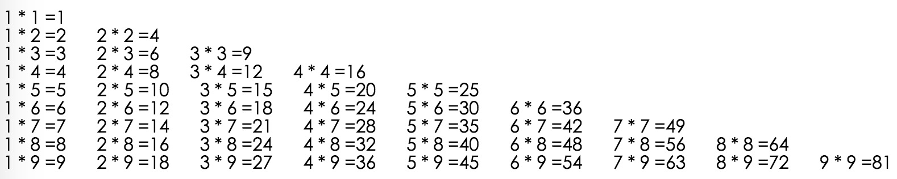

1. 使用三目运算符判断一个整形的奇偶行，如果是奇数，输出“这个数字是奇数”，如果是偶数，输出“这个数字是偶数”;
2. 使用赋值语句，实现两个变量值的互换，既$a=8;$b=9;最后输出$a的值为9,$b的值是8;
3. 使用判断语句判断某一年是否是闰年
4. 会员折扣制度，当消费数额达到200元的时候，可以享受折扣，累计累积消费每达到200块钱，会员的折扣汇减少0.5折，当累积消费为205的时候，这时候客户再次消费就是九五折。当次消费不计入累计消费中。累计消费值，和档次消费值，都可以假设。
5. 一个变量代表从1～12的月份，实现变量判断季度。既1，2，12月为冬季。3，4，5月为春季。6,7,8月为夏天，9,10,11为秋季。
6. 使用while语句遍历数组
	
	$array = array(
		"白鹭","黄鹂","鹦鹉","乌鸦","喜鹊","布谷","斑鸠","百灵鸟"
	)
7. 使用循环嵌套实现九九乘法表

8. 寻找一个数组当中的最小值
9. 把一个二位数组做一次互换
	
	$array = array(
		array(1,2,3),
		array(4,5,6),
		array(7,8,9),
	)
	变换成
	
	$array = array(
		array(1,4,7),
		array(2,5,8),
		array(3,6,9),
	)
10. 使用冒泡算法实现排序
	
	$array = array(8,5,12,55,21,9,33,98,-111)