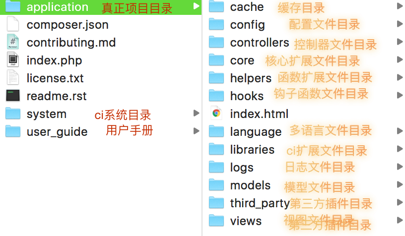

#CodeIgnitor

##MVC
>M,V,C是指。model，view，controler。model指的是模型层，view指的是视图层，controller指的是控制器层。

* model层也叫模型层，在这里我们可以理解成操作数据库的一层。
* view层叫视图层，在这里我们可以理解成界面
* controller层叫控制器层，在这里我们可理解成把模型层和视图层粘合在一起的一层。像一个交警。

###MVC的好处
* 是的各个组件各司其职
* 使得各个岗位各司其职

##目录结构

##单入口
>Codeignitor的入口只有index.php一个。也就是说，不管访问哪里，都是要从index.php当中来运行。

###单入口的好处
* 可以对所有的输入进行过滤。
* 可以对所有的环境做一次性的设置。
* 可以快速的添加

##URL和controller的关系

`http://localhost/index.php/[controller-class]/[controller-method]/[arguments]`
例如
`http://localhost/index.php/news/latest/10`

##controller调用view
参见手册

##controller调用model
参见手册