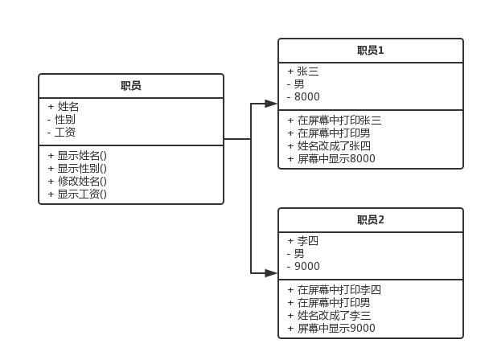
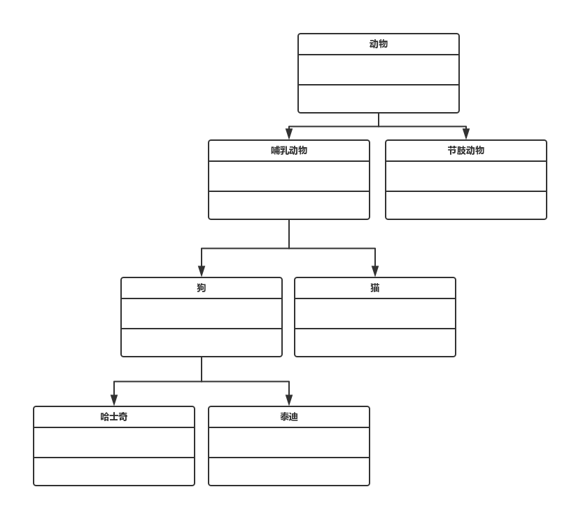

#php的面向对象

##类与对象(实例)
>编程语言的发展历史，从机器语言到汇编语言，从高级语言到面相对象，编程语言越来越往人类能够理解的语言当中发展。

###类
>是描述一类事物的一个抽象概念。比如人，比如狗。

###成员变量/属性
>一类事物的静态属性

###成员方法／方法
>一类事物的动态函数

###对象
>是某个类的具体实现，比如具体的某个人，具体的某只狗。

##类与类之间的关系
###继承关系

##php中的类
###类的定义
	class 类名{
		属性类型 属性1;
		属性类型 属性2;
		
		function 函数名1(函数参数列表){
			函数体;
			return 返回值;
		}
		function 函数名2(函数参数列表){
			函数体;
			return 返回值;
		}
	}

	class person{
		public $name;
		private $age=0;
		
		function setName($name){
			$this->name = $name;
		}
	}
	
	$person1 = new Person();
	$person->setName('jack');
	
	$person2 = new Persion();
	$person->setName('jacky');
	
	echo $person1->name;
	
###$this变量访问方法和属性
>在对象创建的时候，php会自动创建一个叫$this的特殊变量，它表示一个对对象本身的引用。

###public,private属性
####public 公共成员变量，可以直接访问
####privata，私有成员边俩个，不允许直接访问，只能用$this访问。

	

###静态属性
>不需要new，直接可以访问的属性

	class MyClass{
		static $pi=3.14;
		function myMethod(){
			echo self::$pi;
		}
		statick staticMethod(){
			echo self::$pi;
		}
	}
	print MyClass::$pi;
	print MyClass::staticMethod();

###new关键字和构造函数
>使用new关键字可以创建一个类的实例

	class Person{
		public $name;
		function __construct($name){
			$this->name = $name;
		}
	}
	$person1 = new Person($name);
	echo $person1->$name;

###析构函数
	
	class MyClass{
		function __destruct(){
			echo "我被消除了";
		}
	}
	
	$obj = new MyClass();
	$obj = null;
	
##多态

###继承

	class 子类 extends 父类{
		类定义
	}
	
	class Animal{
		function makeSound(){
		
		}
	}
	
	class Cat extends Animal{
		function makeSound(){
			echo "miao";
		}
	}
	
	class Dog extends Animal{
		function makeSound(){
			echo "wang";
		}
	}
	
###parent::
>指向父类的关键字

 	class Animal{
 		function __construct(){
 			echo "Animal";
 		}
 	}
 	
 	class Cat exntends Animal{
 		function __co
 		nstruct(){
 			parent::__construct();
 			echo "Cat";
 		}
 	}
###protected关键字
>仅允许子类引用

###参数中使用类
	function yello(Animal $a){
		
	}

###instanceOf运算符
	$cat = new Cat();
	if($cat instance Cat){
		echo "这玩意是猫";
	}
###Abstract方法
>只定义方法名，不定义方法体；

###__toString()成员方法

	class Person{
		function __construct($name){
			$this->name = $name;
		}
		function __toString(){
			return $this->name;
		}
	}
	$person = new Person();
	echo $person;

### __autoload函数

###处理异常
	class Exception{
		function __construct($message,[,$code]);
		final public getMessage();
		final public getCode();
		final public getFile();
		final public getLine();
		final public getTrace();
		final public getTraceAsString();
		
		protected $message;
		protected $code;
		protected $file;
		protected $line;
	}

	try{
		...
	}catch(异常类型 $exception){
		...
	}catch()
	
	thow 异常类型;
	
	class NullHandleException Extends Exception{
		function __construct($message){
			parent::__construct($message);
		}
	}
	
	function printObject(){
		throw new NullHandleException("好郁闷");
	}
	try{
	printObject();
	}catch(NullHandleException $e){
		echo $e->getMessage();
	}

###__get(),__set(),__call()

__get($property) 当访问属性的时候，属性不存在的时候调用。

__set($property,$value) 当设置属性的时候，属性不存在的时候。

__call($method,$args)当调用方法的时候，方法不存在的时候。 
